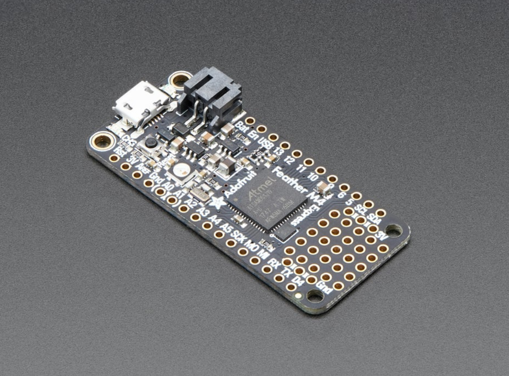
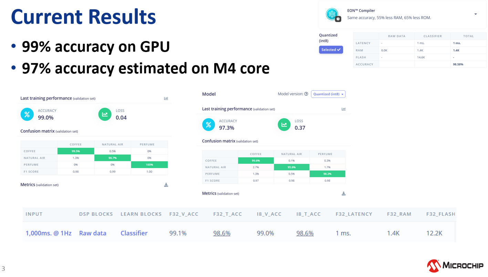

# E-nose


# Project Overview

E-nose system capable of differentiating **perfume**, **coffee**, and **clean air** with 98% accuracy

This project uses an array of six MQ-series gas sensors combined with a lightweight machine learning model trained using **Edge Impulse**.  
The model is deployed on the **Adafruit Feather M4 Express**, which supports **TensorFlow Lite Micro** for efficient ARM-based inference.


# Hardware Setup

## Wiring Diagram (Prototype on Feather M4 Express)


## Sensor Array Used
The following sensors make up the current gas-detection array:

| Sensor | Primary Sensitivity |
|--------|----------------------|
| DF-NH3 | Ammonia |
| MQ-136 | Hydrogen sulfide |
| MQ-135 | VOCs / CO₂ |
| MQ-8 | Hydrogen |
| MQ-4 | Methane |
| MQ-2 | Smoke / LPG |

These sensors together form a basic but effective VOC fingerprint for classification.

## MCU: Adafruit Feather M4 Express

Reasons:
- ARM Cortex-M4F with hardware floating-point accelerators  
- Fully supported by TensorFlow Lite Micro  
- Supported directly by Edge Impulse Arduino libraries  
- Higher performance vs AVR for ML workloads



---

# Model Training (Edge Impulse)

Project (public link):  
https://studio.edgeimpulse.com/public/661994/live

### Data Types Collected
- 6 analog voltage channels  
- Sampling frequency ~20 Hz  
- 5-second windows (~100 sample frames)  
- Labels: **Perfume**, **Coffee**, **Natural Air**

### Model Performance

- **99% accuracy on GPU (training)**
- **~97% estimated accuracy on Feather M4**
- Latency: **~5 seconds**
- Low overfitting risk (consistent validation performance)



---

# Data Collection Pipeline

### 1. Upload firmware to Arduino for sensor reading  
Source file:  
`collect-sensor-array.ino`  
:contentReference[oaicite:0]{index=0}

### 2. Log sensor values using Python
Script:  
`record-sensor-array.py`  


Run:

```bash
python record-sensor-array.py
```

This script:
- Reads serial output  
- Cleans & parses voltage values  
- Saves into a CSV dataset  

---

# Edge Impulse Workflow

### Step 1 — Clone the project  
Go to **[studio.edgeimpulse.com](https://studio.edgeimpulse.com/public/661994/live)** → *Clone Project*

### Step 2 — Import your own data (Optional)
**Data Acquisition → Upload Data**  
Upload CSV files generated from your Python logger.

### Step 3 — Build an impulse  
**Impulse Design → Create impulse**

Recommended:
- **Window size:** 5000 ms  
- **Frequency:** 20 Hz  
- **DSP Block:** Raw Data  
- **ML Block:** Classification (Neural Network)

### Step 4 — Train the model  
**Impulse Design → Classification**

Settings:
- Epochs: **100**
- Learning rate: **0.001**
- Train/Test Split: **80/20**

---

# Deployment to Adafruit Feather M4

### Step 1 — Export Arduino library  
Go to:

**Deployment → Arduino Library → EON Optimizer (uint8)**  
Download the ZIP and place it under:

```
Documents/Arduino/libraries/
```

Restart Arduino IDE.
Click on Sketch -> Include Zip Library -> Install the library.

### Step 2 — Use the included inference sketch  

Inside the exported folder:

```
examples/arduino/feather-m4/feather-ei-inferencing.ino
```

This code:
- Reads analog data  
- Formats a feature vector  
- Passes it to the model  
- Prints probability scores  

### Typical Output

```
Coffee: 0.98
Perfume: 0.01
Natural Air: 0.00
```

---


# License
MIT License

---

# Contact
gokce.yavuz@microchip.com
December 2025  
E-Nose Project  
